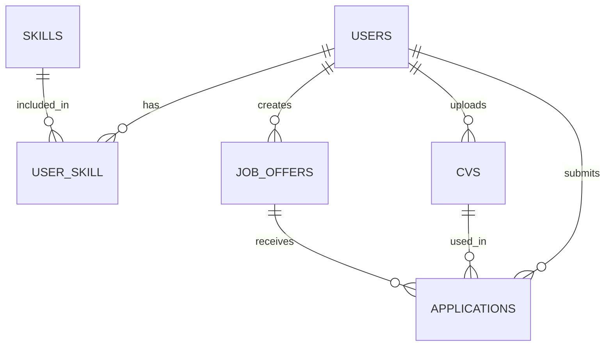

# Job Application API

<div align="center">


</div>

<p align="center">
  <svg xmlns="http://www.w3.org/2000/svg" viewBox="0 0 900 560" style="background-color: white;">
  <!-- Background styling -->
  <defs>
    <filter id="shadow" x="-20%" y="-20%" width="140%" height="140%">
      <feDropShadow dx="1" dy="1" stdDeviation="1.5" flood-opacity="0.15"/>
    </filter>
  </defs>

  <!-- Title -->
  <text x="450" y="60" font-family="Arial, sans-serif" font-size="36" font-weight="bold" text-anchor="middle" fill="#5D3891">Job Application API</text>
  
  <!-- Section Headers (now above boxes) -->
  <text x="250" y="135" font-family="Arial, sans-serif" font-size="24" font-weight="bold" fill="#5D3891">Client Side</text>
  <text x="650" y="135" font-family="Arial, sans-serif" font-size="24" font-weight="bold" fill="#5D3891">Server Side</text>
  
  <!-- Client Side Box -->
  <rect x="100" y="150" width="300" height="330" fill="#F9F9F9" stroke="#5D3891" stroke-width="2" stroke-dasharray="10,10" rx="10" ry="10"/>
  
  <!-- Server Side Box -->
  <rect x="510" y="150" width="280" height="330" fill="#F9F9F9" stroke="#5D3891" stroke-width="2" rx="10" ry="10"/>
  
  <!-- API Gateway - Central hexagon -->
  <polygon points="450,290 500,260 500,200 450,170 400,200 400,260" fill="#4D77FF" stroke="#4D77FF" stroke-width="1" filter="url(#shadow)"/>
  <text x="450" y="215" font-family="Arial, sans-serif" font-size="22" font-weight="bold" text-anchor="middle" fill="white">API</text>
  <text x="450" y="245" font-family="Arial, sans-serif" font-size="16" font-weight="bold" text-anchor="middle" fill="white">Gateway</text>
  
  <!-- Authentication icon above API -->
  <g transform="translate(450, 110)">
    <circle cx="0" cy="0" r="22" fill="white" stroke="#E0E0E0" stroke-width="1.5" filter="url(#shadow)"/>
    <text x="0" y="5" font-family="Arial, sans-serif" font-size="16" text-anchor="middle" fill="#FF9800">🔒</text>
    <text x="0" y="35" font-family="Arial, sans-serif" font-size="14" text-anchor="middle" font-weight="bold" fill="#666">Authentication</text>
  </g>
    
  <!-- Recruiter -->
  <g transform="translate(170, 220)">
    <circle cx="0" cy="0" r="50" fill="white" stroke="#E0E0E0" stroke-width="1.5" filter="url(#shadow)"/>
    <text x="0" y="-5" font-family="Arial, sans-serif" font-size="16" font-weight="bold" text-anchor="middle" fill="#444">👔 Recruiter</text>
    <text x="0" y="20" font-family="Arial, sans-serif" font-size="14" text-anchor="middle" fill="#666">Manage jobs</text>
  </g>
  
  <!-- Candidate -->
  <g transform="translate(170, 370)">
    <circle cx="0" cy="0" r="57" fill="white" stroke="#E0E0E0" stroke-width="1.5" filter="url(#shadow)"/>
    <text x="0" y="-5" font-family="Arial, sans-serif" font-size="16" font-weight="bold" text-anchor="middle" fill="#444">👤 Candidate</text>
    <text x="0" y="20" font-family="Arial, sans-serif" font-size="14" text-anchor="middle" fill="#666">Apply for jobs</text>
  </g>
  
  <!-- Components -->
  
  <!-- Job Listings -->
  <g transform="translate(330, 195)">
    <circle cx="0" cy="0" r="40" fill="white" stroke="#E0E0E0" stroke-width="1.5" filter="url(#shadow)"/>
    <text x="0" y="-10" font-family="Arial, sans-serif" font-size="14" font-weight="bold" text-anchor="middle" fill="#444">📋 Job</text>
    <text x="0" y="10" font-family="Arial, sans-serif" font-size="14" font-weight="bold" text-anchor="middle" fill="#444">Listings</text>
  </g>
  
  <!-- CV Upload -->
  <g transform="translate(330, 295)">
    <circle cx="0" cy="0" r="40" fill="white" stroke="#E0E0E0" stroke-width="1.5" filter="url(#shadow)"/>
    <text x="0" y="-10" font-family="Arial, sans-serif" font-size="14" font-weight="bold" text-anchor="middle" fill="#444">📄 CV</text>
    <text x="0" y="10" font-family="Arial, sans-serif" font-size="14" font-weight="bold" text-anchor="middle" fill="#444">Upload</text>
  </g>
  
  <!-- Applications -->
  <g transform="translate(330, 395)">
    <circle cx="0" cy="0" r="40" fill="white" stroke="#E0E0E0" stroke-width="1.5" filter="url(#shadow)"/>
    <text x="0" y="4" font-family="Arial, sans-serif" font-size="14" font-weight="bold" text-anchor="middle" fill="#444">📨 App</text>
  </g>
  
  <!-- Server Components -->
  
  <!-- Controllers -->
  <g transform="translate(650, 190)">
    <rect x="-80" y="-30" width="175" height="60" rx="8" ry="8" fill="white" stroke="#E0E0E0" stroke-width="1.5" filter="url(#shadow)"/>
    <text x="0" y="-5" font-family="Arial, sans-serif" font-size="16" font-weight="bold" text-anchor="middle" fill="#444">Controllers</text>
    <text x="7" y="20" font-family="Arial, sans-serif" font-size="12" text-anchor="middle" fill="#666">Auth, JobOffer, CV, Application</text>
  </g>
  
  <!-- Database -->
  <g transform="translate(650, 295)">
    <ellipse cx="0" cy="-25" rx="50" ry="15" fill="white" stroke="#5D3891" stroke-width="2"/>
    <rect x="-50" y="-25" width="100" height="50" fill="white" stroke="#5D3891" stroke-width="2"/>
    <ellipse cx="0" cy="25" rx="50" ry="15" fill="white" stroke="#5D3891" stroke-width="2"/>
    <text x="0" y="5" font-family="Arial, sans-serif" font-size="18" font-weight="bold" text-anchor="middle" fill="#5D3891">Database</text>
  </g>
  
  <!-- Models -->
  <g transform="translate(650, 395)">
    <rect x="-80" y="-30" width="180" height="60" rx="8" ry="8" fill="white" stroke="#E0E0E0" stroke-width="1.5" filter="url(#shadow)"/>
    <text x="0" y="-5" font-family="Arial, sans-serif" font-size="16" font-weight="bold" text-anchor="middle" fill="#444">Models</text>
    <text x="9" y="20" font-family="Arial, sans-serif" font-size="12" text-anchor="middle" fill="#666">User, CV, JobOffer, Application</text>
  </g>
  
  <!-- Technologies labels -->
  <g transform="translate(650, 510)">
    <rect x="-130" y="-25" width="260" height="50" rx="25" ry="25" fill="#F5F5F5" stroke="#E0E0E0" stroke-width="1"/>
    <text x="0" y="0" font-family="Arial, sans-serif" font-size="14" text-anchor="middle" fill="#666">Laravel 11 • Sanctum • PHP 8.2+</text>
    <text x="0" y="20" font-family="Arial, sans-serif" font-size="12" text-anchor="middle" fill="#888">MySQL/PostgreSQL</text>
  </g>
  
  <!-- Define the arrowhead marker -->
  <defs>
    <marker id="arrowhead" markerWidth="8" markerHeight="6" refX="8" refY="3" orient="auto">
      <polygon points="0 0, 8 3, 0 6" fill="#AAAAAA"/>
    </marker>
  </defs>

  <!-- Arrows with clean paths -->
  
  <!-- Authentication to API -->
  <line x1="450" y1="140" x2="450" y2="160" stroke="#AAAAAA" stroke-width="2" marker-end="url(#arrowhead)"/>
  
  <!-- Recruiter to Job Listings -->
  <line x1="220" y1="210" x2="285" y2="195" stroke="#AAAAAA" stroke-width="2" marker-end="url(#arrowhead)"/>
  
  <!-- Candidate to CV Upload -->
  <line x1="220" y1="340" x2="295" y2="315" stroke="#AAAAAA" stroke-width="2" marker-end="url(#arrowhead)"/>
  
  <!-- Candidate to Applications -->
  <line x1="224" y1="380" x2="285" y2="395" stroke="#AAAAAA" stroke-width="2" marker-end="url(#arrowhead)"/>
  
  <!-- Job Listings to API -->
  <line x1="370" y1="195" x2="395" y2="210" stroke="#AAAAAA" stroke-width="2" marker-end="url(#arrowhead)"/>
  
  <!-- CV Upload to API -->
  <line x1="370" y1="290" x2="395" y2="250" stroke="#AAAAAA" stroke-width="2" marker-end="url(#arrowhead)"/>
  
  <!-- Applications to API -->
  <line x1="370" y1="385" x2="400" y2="260" stroke="#AAAAAA" stroke-width="2" marker-end="url(#arrowhead)"/>
  
  <!-- API to Controllers -->
  <line x1="500" y1="210" x2="560" y2="190" stroke="#AAAAAA" stroke-width="2" marker-end="url(#arrowhead)"/>
  
  <!-- API to Database -->
  <line x1="500" y1="230" x2="590" y2="290" stroke="#AAAAAA" stroke-width="2" marker-end="url(#arrowhead)"/>
  
  <!-- Controllers to Database -->
  <line x1="650" y1="230" x2="650" y2="260" stroke="#AAAAAA" stroke-width="2" marker-end="url(#arrowhead)"/>
  
  <!-- Models to Database -->
  <line x1="650" y1="360" x2="650" y2="330" stroke="#AAAAAA" stroke-width="2" marker-end="url(#arrowhead)"/>
</svg>
</p>

A modern, secure API for job applications platform with authentication, user roles, job listing management, and CV handling. Built on Laravel 11 with Sanctum authentication.

## ✨ Features

<div align="center">

| ✅ Authentication | 🔒 Role-based Access | 📝 Job Management | 📄 CV Upload |
|------------------|---------------------|-------------------|--------------|
| Laravel Sanctum authentication for secure API access | Separate permissions for recruiters and candidates | CRUD operations for job listings | Upload and manage CVs with validation |

</div>

## 📋 Core Components

- **User Management**
  - Registration and authentication with Sanctum
  - Profile management including skills
  - Role-based permissions (candidate/recruiter)

- **Job Offer Management**
  - Complete CRUD operations for recruiters
  - Browsing capabilities for candidates

- **CV and Application Management**
  - CV upload (PDF/DOCX with 5MB limit)
  - Job application submissions

## 🚀 Installation

```bash
# Clone the repository
git clone https://github.com/protocol-404/job-application-api.git
cd job-application-api

# Install dependencies
composer install

# Configure environment
cp .env.example .env
# Update database configuration in .env file

# Generate application key
php artisan key:generate

# Run migrations
php artisan migrate

# Create storage link for CV files
php artisan storage:link

# Serve the application
php artisan serve
```

Your API will be available at: http://localhost:8000

## 🔌 API Endpoints

<details>
<summary><b>Authentication</b></summary>

- `POST /api/register` - Register a new user
- `POST /api/login` - Login and get token
- `POST /api/logout` - Logout (requires authentication)
</details>

<details>
<summary><b>User Management</b></summary>

- `GET /api/user` - Get current user profile
- `PUT /api/user` - Update user profile
- `GET /api/user/skills` - Get user skills 
- `POST /api/user/skills` - Add skills to user
</details>

<details>
<summary><b>Job Offers</b></summary>

- `GET /api/job-offers` - List all job offers
- `GET /api/job-offers/{id}` - View single job offer
- `POST /api/job-offers` - Create job offer (recruiter only)
- `PUT /api/job-offers/{id}` - Update job offer (recruiter only)
- `DELETE /api/job-offers/{id}` - Delete job offer (recruiter only)
</details>

<details>
<summary><b>CV Management</b></summary>

- `GET /api/cvs` - List user's CVs
- `POST /api/cvs` - Upload new CV
- `DELETE /api/cvs/{id}` - Delete CV
</details>

<details>
<summary><b>Applications</b></summary>

- `GET /api/applications` - List user's applications
- `POST /api/applications` - Apply for a job
- `GET /api/job-offers/{id}/applications` - List applications for a job (recruiter only)
</details>

## 🧪 Testing with Postman

A complete [Postman Collection](docs/api_documentation.json) is included to test all API endpoints.

1. Import the collection into Postman
2. Create an environment with variables:
   - `base_url`: http://localhost:8000/api
   - `token`: (automatically set after login)
3. Run the authentication requests first to obtain a token

## 🔧 Technologies Used

- **Laravel 11**: Modern PHP framework
- **Laravel Sanctum**: API authentication
- **MySQL/PostgreSQL**: Database options
- **Laravel Storage**: CV file handling

## 📊 Database Structure



## 📈 Project Roadmap

- [x] Basic API functionality
- [x] Authentication & Authorization
- [x] Job Offer Management
- [x] CV Upload & Applications
- [ ] Notifications
- [ ] Advanced search functionality
- [ ] Resume parsing
- [ ] Application status tracking

## 🤝 Contributing

Contributions are welcome! Please feel free to submit a Pull Request.

1. Fork the project
2. Create your feature branch (`git checkout -b feature/amazing-feature`)
3. Commit your changes (`git commit -m 'Add some amazing feature'`)
4. Push to the branch (`git push origin feature/amazing-feature`)
5. Open a Pull Request

---

<div align="center">

Made with ❤️ by [Protocol](https://github.com/protocol-404)

</div>
# job-application-api
