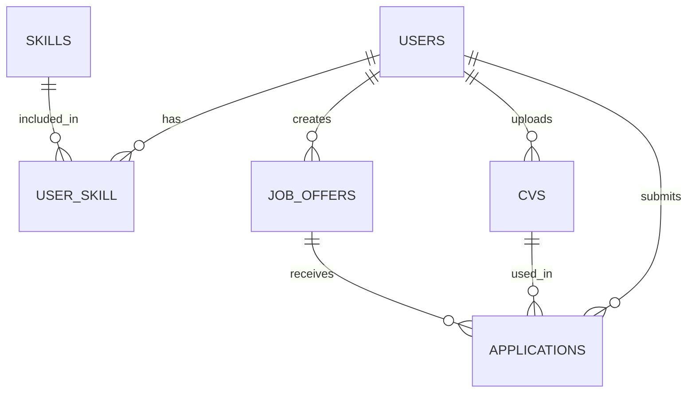

# Job Application API

<div align="center">


</div>

<p align="center">
  
</p>

A modern, secure API for job applications platform with authentication, user roles, job listing management, and CV handling. Built on Laravel 11 with Sanctum authentication.

## ✨ Features

<div align="center">

| ✅ Authentication | 🔒 Role-based Access | 📝 Job Management | 📄 CV Upload |
|------------------|---------------------|-------------------|--------------|
| Laravel Sanctum authentication for secure API access | Separate permissions for recruiters and candidates | CRUD operations for job listings | Upload and manage CVs with validation |

</div>

## 📋 Core Components

- **User Management**
  - Registration and authentication with Sanctum
  - Profile management including skills
  - Role-based permissions (candidate/recruiter)

- **Job Offer Management**
  - Complete CRUD operations for recruiters
  - Browsing capabilities for candidates

- **CV and Application Management**
  - CV upload (PDF/DOCX with 5MB limit)
  - Job application submissions

## 🚀 Installation

```bash
# Clone the repository
git clone https://github.com/protocol-404/job-application-api.git
cd job-application-api

# Install dependencies
composer install

# Configure environment
cp .env.example .env
# Update database configuration in .env file

# Generate application key
php artisan key:generate

# Run migrations
php artisan migrate

# Create storage link for CV files
php artisan storage:link

# Serve the application
php artisan serve
```

Your API will be available at: http://localhost:8000

## 🔌 API Endpoints

<details>
<summary><b>Authentication</b></summary>

- `POST /api/register` - Register a new user
- `POST /api/login` - Login and get token
- `POST /api/logout` - Logout (requires authentication)
</details>

<details>
<summary><b>User Management</b></summary>

- `GET /api/user` - Get current user profile
- `PUT /api/user` - Update user profile
- `GET /api/user/skills` - Get user skills 
- `POST /api/user/skills` - Add skills to user
</details>

<details>
<summary><b>Job Offers</b></summary>

- `GET /api/job-offers` - List all job offers
- `GET /api/job-offers/{id}` - View single job offer
- `POST /api/job-offers` - Create job offer (recruiter only)
- `PUT /api/job-offers/{id}` - Update job offer (recruiter only)
- `DELETE /api/job-offers/{id}` - Delete job offer (recruiter only)
</details>

<details>
<summary><b>CV Management</b></summary>

- `GET /api/cvs` - List user's CVs
- `POST /api/cvs` - Upload new CV
- `DELETE /api/cvs/{id}` - Delete CV
</details>

<details>
<summary><b>Applications</b></summary>

- `GET /api/applications` - List user's applications
- `POST /api/applications` - Apply for a job
- `GET /api/job-offers/{id}/applications` - List applications for a job (recruiter only)
</details>

## 🧪 Testing with Postman

A complete [Postman Collection](docs/api_documentation.json) is included to test all API endpoints.

1. Import the collection into Postman
2. Create an environment with variables:
   - `base_url`: http://localhost:8000/api
   - `token`: (automatically set after login)
3. Run the authentication requests first to obtain a token

## 🔧 Technologies Used

- **Laravel 11**: Modern PHP framework
- **Laravel Sanctum**: API authentication
- **MySQL/PostgreSQL**: Database options
- **Laravel Storage**: CV file handling

## 📊 Database Structure



## 📈 Project Roadmap

- [x] Basic API functionality
- [x] Authentication & Authorization
- [x] Job Offer Management
- [x] CV Upload & Applications
- [ ] Notifications
- [ ] Advanced search functionality
- [ ] Resume parsing
- [ ] Application status tracking

## 🤝 Contributing

Contributions are welcome! Please feel free to submit a Pull Request.

1. Fork the project
2. Create your feature branch (`git checkout -b feature/amazing-feature`)
3. Commit your changes (`git commit -m 'Add some amazing feature'`)
4. Push to the branch (`git push origin feature/amazing-feature`)
5. Open a Pull Request

---

<div align="center">

Made with ❤️ by [Protocol](https://github.com/protocol-404)

</div>
# job-application-api
